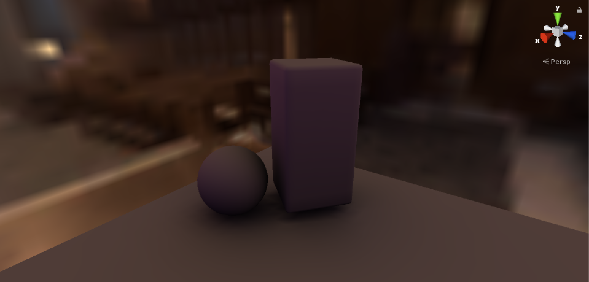
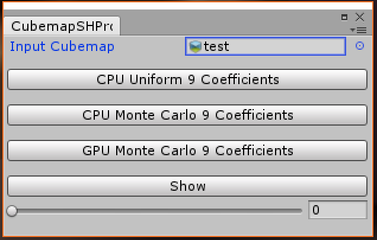

# Unity Spherical Harmonics Tools

  

## Overview
In this project the are two tools: the first one takes an input cubemap and project into the spherical harmonic basis and print the first three bands (**9 coefficients**). It's possible to compute this projection with 3 different techniques:
- On the **CPU** with **uniform sampling**, which means reading all the texels of the cubemap.
- On the **CPU** with **Monte Carlo sampling**, which means less texture readings, more rapid but with an approximated result.
- On the  **GPU** with **Monte Carlo sampling**, with a result similar to the CPU one but faster.
- On the **GPU** with **uniform sampling**, using a *Compute Shader*, this gives the accuracy of CPU uniform sampling with maximum speed. **I Recommend using this.**

Once the result is computed you can see it and toggle the original version and the projected one.

  

The second tool is a component to add on a game object; its purpose is to get all the game object's children and foreach of their vertices compute and project onto the SH basis the **Geometry Factor**. It won't change directly the objects meshes but will create a clone object to modify.

The **Geometry Factor** describes the visibility from the vertex (so 0 if the vertex is occluded or 1 if the vertex can see direclty the environment from direction **v**) multiplied with che **cosine** of the **vertex normal** with the direction **v**. **TO WORK ALL OBJECTS IN THE SCENE MUST HAVE AN UNLIT BLACK MATERIAL**
> At the momenty Unity doesn't support custom vertex attributes so i had to put the 9 coefficients in the existing ones, organizing them in this way: first 4 coefficients in the vertex color rgba, the next 2 in the uv2,  the next 2 in the uv3 and the last one in the x component of uv4. It's a temporary solution and i hope to find a better workaround.
